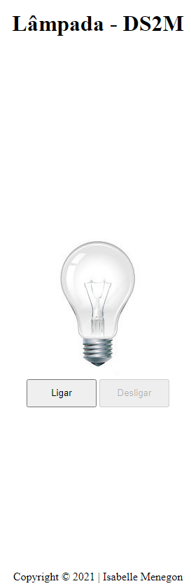

# Projeto lâmpada 

Projeto criado com o objetivo didático para as aulas de PWFE do curso de Desenvolvimento de Sistemas do [SENAI Jandira](https://jandira.sp.senai.br/), sobre Orientaão do [Professor Leonid](https://www.google.com/search?q=teste&rlz=1C1GCEU_pt-BRBR965BR965&oq=teste&aqs=chrome..69i57j0i512l9.996j0j7&sourceid=chrome&ie=UTF-8)

O projeto consiste em criar uma lâmpada que tenha 3 ações, utilizando diversos eventos:
* Ligar

* Desligar

* Quebrar

o código foi construído pensando em boas práticas, como responsabilidade única e funções puras.

